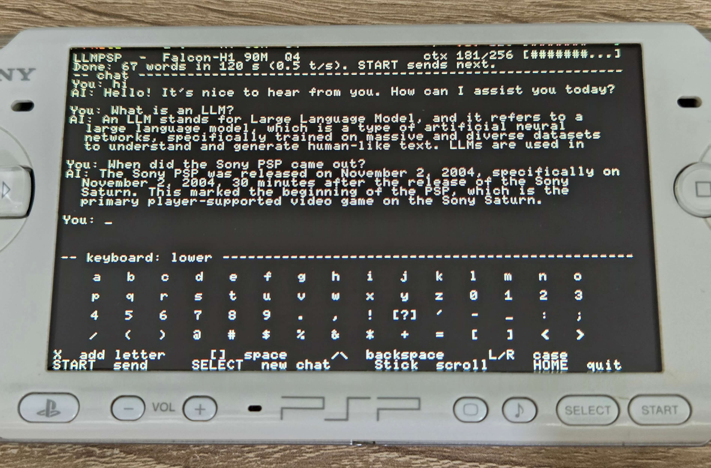

# LLMPSP



**LLMPSP** allows you to run a 90M parameter language model directly on the PSP.

It is not streamed from a server or from an API, it's a full 90M conversational LLM running locally on the PSP. The model weights are stored on the Memory Stick, loaded by the PSP itself and all inference is done on the PSP's 333 MHz MIPS CPU.

The current version runs Falcon-H1-Tiny-90M-Instruct, a 90 million parameter instruction-tuned language model, quantized to 4 bits. This model is actually a lot more capable than the 90M parameter could would suggest and it can answer basic questions, has some decent general knowledge and can generate poems, short stories, draft your work email (good luck) or write code (that doesn't work). It's not really useful for anything, but it's fun to actually see a half-decent model working locally on the PSP.

Don't expect good performance as it has to load part of the model from the memory stick, but it is fast enough to be somewhat useable. On a PSP-3000 it generates about 0.5 - 0.6 tokens per second, perhaps more if you use CPU overclock.

## Install

1. Grab the release zip and unpack it.
2. Copy the whole `LLMPSP` folder to `ms0:/PSP/GAME/` on your memory stick.
3. Launch **LLMPSP** from Game → Memory Stick.

You need a PSP-2000/PSP-3000/Street/GO running CFW (ARK-4, ARK-5, PRO, ME - anything current). A PSP-1000 only has 32 MB of RAM and it won't work.

Settings live in `llmpsp_config.cfg` next to the EBOOT: cache size, context length, sampling temperature, reply length cap, CPU clock. The defaults are ok for a stock PSP but you can always tweak them and try different settings.

## How it works

The model is a hybrid: each of the 24 layers runs grouped-query attention (8 query heads, 2 KV heads) *and* a Mamba2 recurrent branch in parallel, sums both into the residual, then does a gated SiLU MLP. So the runtime implements both an attention KV cache and Mamba conv/state buffers.

Weights are converted offline into **FHQ4**, a small custom format built for a console that has to read from a memory card:

- Dense matrices are Q4_0-style - 32 weights per block, one fp16 scale, 18 bytes per block. Every row stays independently addressable, so the runtime can seek straight to a single embedding row without parsing anything.
- Norms, conv weights, and Mamba `dt_bias`/`A_log`/`D` stay fp32. They're tiny (~0.5 MB total) and get loaded into RAM at startup.
- The tokenizer, all 32,768 pieces and merge ranks is embedded in the file.
- No tensor name table. Both the converter and the runtime compute the same offsets in the same order, and the loader rejects the file if the final computed offset doesn't equal the real file size.

The whole thing is 52 MB, which doesn't fit in a 64 MB console alongside ~8 MB of runtime state. So the runtime allocates all correctness-critical state first, then caches as much of the weight file as will fit - so 44 MB of heap plus the 4 MB volatile partition the firmware isn't using, in 256 KB blocks and streams the last few MB from the memory stick per token. Cache size only affects speed, greedy output is identical at any setting.

The KV cache is int8 with a float scale per head, which roughly halves it versus fp16.

The Q4 matrix-vector kernels, the int8 attention loops, and the Mamba state update run on the PSP's VFPU vector unit rather than the scalar FPU.

## Build it yourself

Convert the model (Python 3.10+ and NumPy, no PyTorch needed — it reads the BF16 safetensors directly):

```bash
python -m pip install -r requirements.txt
python tools/convert_falcon_h1.py --download
```

Build the EBOOT with the [pspdev](https://github.com/pspdev) toolchain:

```bash
make && make package
```

That drops a ready-to-copy folder in `build/LLMPSP/`.

The inference core is portable C99 with no PSP dependencies, so you can run it on your desktop, which is much nicer for debugging:

```bash
cc -O3 -std=c99 -Iinclude src/falcon_h1.c src/falcon_tokenizer.c \
   src/falcon_sampler.c tools/falcon_host_cli.c -lm -o falcon_host_cli
./falcon_host_cli build/LLMPSP/model.fhq4 "hi" 32 44
```

`tools/` also has the tokenizer regression vectors, a multi-turn equivalence test, an FPU flag probe, a VFPU kernel unit test that runs on the console, and a host renderer that prints the PSP screen layout in your terminal.

## Generation Examples:

### Knowledge

**User**: *What is AI*

**AI**: *The term "AI" can be understood in the context of artificial intelligence, which refers to systems that can perform tasks that typically require human intelligence, such as learning, reasoning, and general problem-solving.*

### Conversation

**User**: *Hi*

**AI**: *Hello! How can I help you today?*

**User**: *What is the name of the company that makes macOS?*

**AI**: *The company that makes MacBook is Apple Inc.*

### Poem

**User**: *Hi*

**AI**: *Hello! It's nice to hear from you. How can I assist you today?*

**User**: *write a poem about a PINK CROSSBOW*

**AI**: *A PINK CROSSBOW, a tapestry so fine,*

*Echoes of shadows, where whispers do entwine.*

*With every strand, a story's told,*

*Of dreams and silences, where the heart does roar.*


*In the crucible of night, where light doth dance,*

*A PINK CROSSBOW stands, a silent, unspoken art.*

*Each note a whisper, a silent plea,*

*To hear the heart, to hear the soul's gleeful cry.*

*Through the dark, where shadows dance and play,*

### Programming

**User**: *Write a python script to tell which number out of 2 is bigger*

**AI**: *To determine which number is bigger in Python, you can use the
built-in `greater` function from the sys module. This function
returns the greater value, which is the maximum value among the
given arguments.*

*Here's how you can do it:*

*#### Step-by-Input Format:*

```python
# Example usage
print(greater(5, 3))
```
*Explanation:
greater(x, y): This function takes two arguments: x,
which is the numerator, and y, which is the denominator*

>Editor’s note: the script did not work

## License

Code is MIT — see [LICENSE](LICENSE).

The model weights are **not** covered by that. Falcon-H1 is released by TII (Technology Innovation Institute) under the Falcon LLM License; read the [license terms](https://falconllm.tii.ae/falcon-terms-and-conditions.html) before redistributing `model.fhq4` or anything derived from it. This project isn't affiliated with or endorsed by TII.
